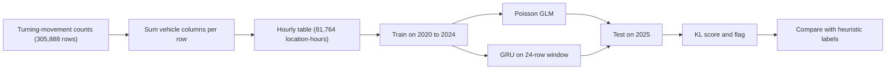

# Toronto Traffic Anomaly Detection

A comparison of a Poisson regression and a GRU neural network on hourly Toronto traffic counts, and of how well each one flags unusual hours.

## Why it matters

Traffic counts change for many reasons, such as collisions, roadworks, weather and events. A traffic monitor needs to flag hours that are unusual, not only hours that are busy. This project asks which model gives the better alarm.

## Results

Test year: 2025, 13,598 hourly rows. The data ends on 4 November 2025, so 2025 is a partial year. Models were trained on 2020 to 2024 (68,166 rows).

| Measure | Poisson GLM | GRU | Reading |
|---|---|---|---|
| RMSE (vehicles per hour) | 890.4 | 407.4 | GRU error is 54.2% lower. |
| MAE | 682.9 | 271.2 | |
| R squared | 0.02 | 0.80 | The GLM explains almost none of the 2025 variation. |
| Anomaly F1 | 0.49 | 0.14 | Against heuristic labels (see Limits). The GLM is the better alarm. |
| ROC-AUC | 0.94 | 0.71 | |
| Average precision | 0.44 | 0.14 | |
| Hours flagged | 649 | 426 | A count of flags, not of false positives. |

The heuristic labels mark 821 of the 13,598 test hours (6.0%) as unusual.

## What I learned

The GRU predicts traffic counts far better. The simpler Poisson GLM flags unusual hours better.

The two models did not get the same inputs. The GRU reads the 24 previous observed rows. The GLM reads four calendar and event features and no history. Part of the forecast gap comes from that difference, not only from the model type.

Blue Jays home games showed no clear effect in this run. The GLM coefficient for match day is -0.0099 on the log scale. The mean GRU anomaly score was 55.9 on match days and 59.7 on other days.

## How it works

- `PMML_Project_Codefile.ipynb`, cells 5 to 9: load the raw CSV and check the columns.
- Cells 11 to 17: sum the car, truck and bus columns into `Road_traffic`. Pedestrian and bike columns are kept apart. The rows are grouped to one row per location and hour (81,764 rows).
- Cell 12: adds a `Match_Day` flag from a list of Blue Jays home dates typed into the notebook.
- Cells 26 to 31: split by date (before 2025 for training, 2025 for testing). Fit the Poisson GLM with L-BFGS-B on four features.
- Cells 32 to 34: train the GRU (hidden size 32, 24-row window, Adam, 500 epochs). Predict 2025.
- Cells 35 to 41: score each hour with a Poisson KL divergence. Flag hours above the mean plus two standard deviations.
- Cells 79 and 82: build the heuristic labels. Report precision, recall, F1, ROC-AUC and average precision.

## Tech stack

Python, pandas, NumPy, PyTorch (GRU), SciPy (L-BFGS-B), scikit-learn (scaling and metrics), Matplotlib and seaborn. Built and run on Google Colab with a GPU.

## Reproduce

- **Data:** the notebook reads `tmc_raw_data_2020_2029.csv` from a Google Drive path (cell 6). The file is not in this repo. It holds City of Toronto turning-movement counts, published on the City of Toronto Open Data portal as "Traffic Volumes at Intersections for All Modes".
- **Install:** `pip install jupyter pandas numpy scipy scikit-learn matplotlib seaborn torch`.
- **Run:** open `PMML_Project_Codefile.ipynb` and run from the top. Several cells are empty or left over from earlier work (cells 18, 19, 43, 47 to 53, 66, 73, 74, 77, 78, 80, 81, 83).
- **Hardware:** the notebook selects CUDA when it is available. It was run on Colab.

## My role

This was a solo course project for EECS 6327 (Probabilistic Models and Machine Learning), York University, under Prof. Hui Jiang, from September to December 2025. I wrote the notebook, the models and the report.

## Limits

- **The labels are heuristics.** A row is unusual if it meets two of four rules: an extreme value, an unusual value for its hour, a large change from the previous row, or the high-traffic flag. The rules use the 2025 rows themselves. The F1 and ROC-AUC numbers depend on these rules.
- **The GLM is a weak baseline.** It has four features and no location term. All locations share one hourly pattern.
- **The GRU and GLM get different inputs.** The GRU sees the previous 24 observed rows. The GLM sees none.
- **Rows are not a continuous hourly series.** Missing hours are not filled in. The rows are sorted by location, then date, and a 24-row window can cross from one location into the next.
- **The GRU scaler saw the 2025 data.** The scaler is fit again on all years before the predictions are turned back into counts (cell 33). The report says scaling used only training data.
- **Match dates are typed in.** The notebook does not cite a source for the list in cell 12.
- **One run per model.** There are no repeat runs or confidence intervals.
- **A stadium-corridor check is not part of these results.** Its negative binomial model has no intercept, so its coefficients should not be used (cells 59 to 72).

## Links

- Project report: [Omkumar M. Patel Project Report PMML.pdf](./Omkumar%20M.%20Patel%20Project%20Report%20PMML.pdf)
- Notebook: [PMML_Project_Codefile.ipynb](./PMML_Project_Codefile.ipynb)
